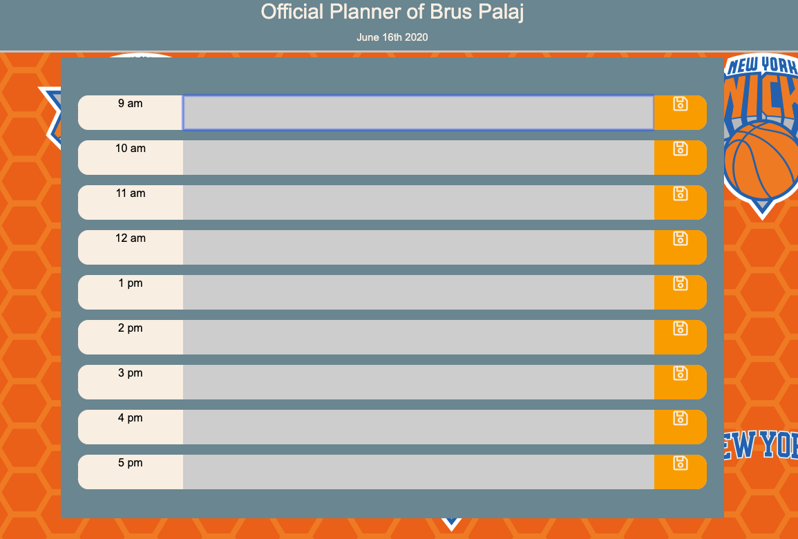
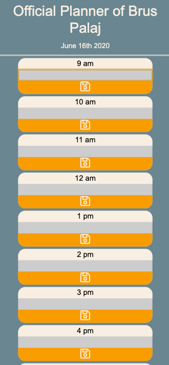

# Work Day Scheduler

https://bruspdoee.github.io/BP-Work-Day-Planner/

<strong>Desktop</strong>
 

<strong>Mobile</strong>
 

 

# What I Did

I created a daily planner using HTML, CSS, JavaScript, jQuery, & AJAX - Moment.js library that:

- Shows the current date at the top of the calendar
- Color coded the timeblocks (gray - past, red - present, green - future)
- Saves information into local storage
- Refresh the page and the events are still there

# More Detailed Overview

- Web App that acts as a 9-5pm Scheduler, broken down into hourly slots to save as your day goes on.

- Once time passes the given hour, it will be highlighted with a to a light grey color symbolizing that this time has passed.

- If the current timeslot is hightlighted red, this means that is the current hour on the clock.

- Whichever remaining timeslots are green are the hours/ time slots that remain in your 9-5 day.

- You can edit time blocks as you please if plans have changed and you want to see an update schedule of what you've done throughout the day
